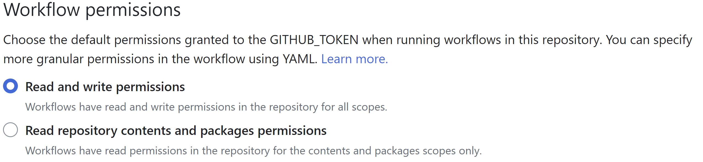
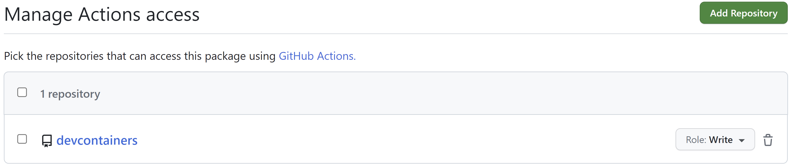

# Devcontainers

## Summary

A devcontainer bundles up your development environment into a container. It utilises docker containers which you can configure to contain all the tools you require. Your files are mounted into the cointainer so that you can develop, run and test your code inside the container.

For info: [Vscode Devcontainers](https://code.visualstudio.com/docs/devcontainers/containers)

## Functionalities

### 1. Prebuilt devcontainers

- A Github action was configured so that when changes are pushed to main, the devcontainer image is rebuilt and pushed to the ghcr. This is so when opening project1 in devcontainer, it will pull the image instead of building it (optimisation)
- TODO:
  - look into only rebuilding image if the devcontainer files have changes...
  - add tests to the image (since the image is overridden every time it is rebuilt)

#### Set up

1. Create a workflow (yml file) under `.github/workflows`. For building a container, it should be similar to [build-containers.yml](.github/workflows/build-containers.yml)
2. Push the new file to repo. The github action will now be available to be triggered.
3. Adjust permissions: for building containers, it will need to have the correct permission to be able to push the package to ghcr.
   a. Repo Permissions: In your repo go to Settings &#8594; Actions &#8594; General &#8594; Workflow Permissions. Then select "Read and write permissions".
   
   b. Package Permissions: navigate to your package &#8594; Package Settings &#8594; Manage Actions access. Then select "write" role for the desired repo.
   

### 2. Easy switch between containers

- When opening up a devcontainer, vscode, by default, will mount the current folder to the devcontainer. As part of the devcontainer's config, you can instead choose which folder gets mounted to the container. This allows you to use the remote explorer to open up containers with the correct folder being opened up. This means you can start in one container, then switch to another easily if you wish. However it still takes around 15-20s to switch between containers...
- TODO:
  - have a closer look through: [improve devcontainer performance](https://code.visualstudio.com/remote/advancedcontainers/improve-performance)

#### Set up

1. Inside `devcontainer.json`, use the `workspaceMount` and `workspaceFolder` parameters. (`workspaceMount` is which file to mount and `workspaceFolder` is the target location in the container)
